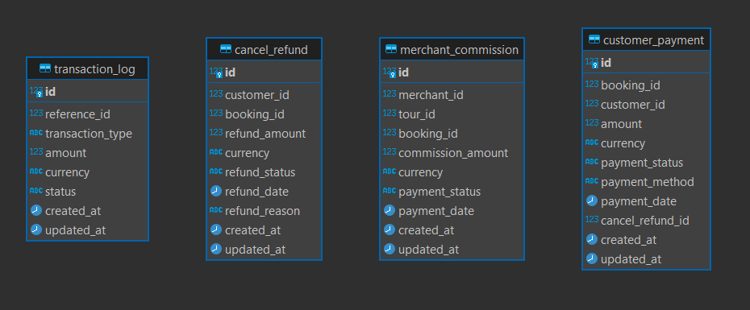

1. services:
   - customer thanh toán giá tour khi booking
   - website thanh toán hoa hồng cho merchant
   - hoàn hủy tour

2. DB:
   - Bảng customer_payment (Thanh toán của khách hàng)
        + Lưu trữ thông tin thanh toán của khách hàng khi đặt tour.
   - Bảng merchant_commission (Hoa hồng thanh toán cho Merchant)
        + Lưu trữ thông tin hoa hồng mà trang web trả cho merchant sau khi giao dịch hoàn tất.
   - Bảng cancel_refund (Hoàn hủy tour và hoàn tiền)
        + Lưu trữ thông tin các giao dịch hoàn tiền cho khách hàng khi họ hủy tour.
   - Bảng transaction_log (Lịch sử giao dịch)
        + Lưu trữ lịch sử tất cả các giao dịch thanh toán, bao gồm thanh toán từ khách hàng và thanh toán cho merchant.

3. Kafka topic:
   - payment-processed: Khi khách hàng thanh toán thành công. Service booking sẽ lắng nghe để cập nhật trạng thái đặt chỗ.
     {
        "payment_id": "",
        "booking_id": "",
        "amount": "",
        "status": ""
     }
   - refund-processed: Khi giao dịch hoàn tiền hoàn tất, payment service sẽ gửi message tới topic này để Service booking consume cập nhật thông tin hủy tour.
     {
        "refund_id": "",
        "booking_id": "",
        "amount": "",
        "status": "",
     }

   - merchant-commission-paid: Khi trang web thanh toán hoa hồng cho merchant.
     {
        "commission_id": "",
        "merchant_id": "",
        "amount": "",
        "status": ""
     }
